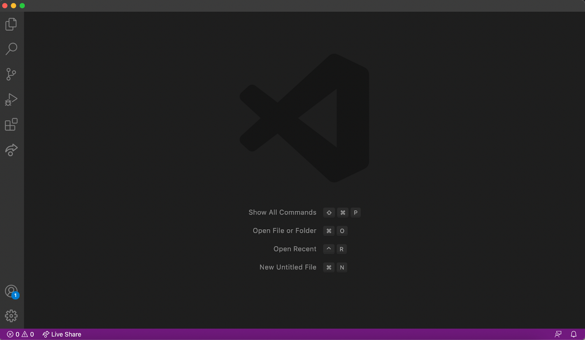
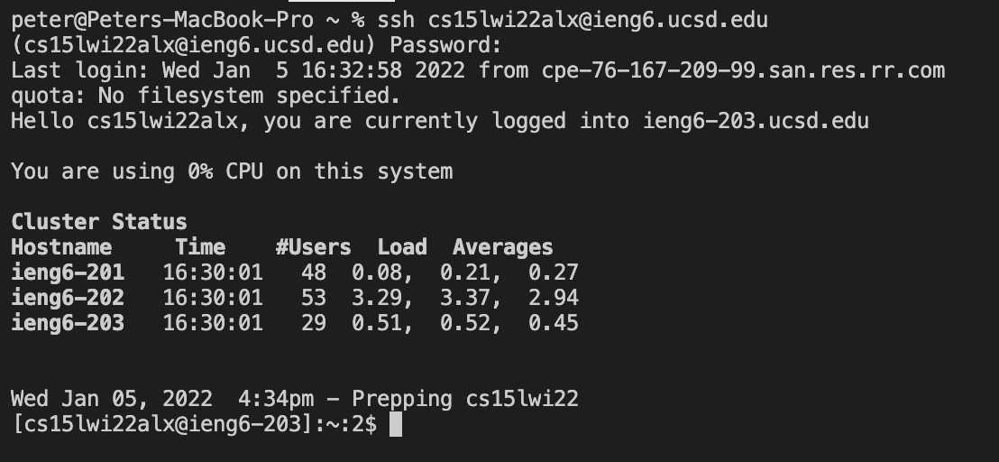
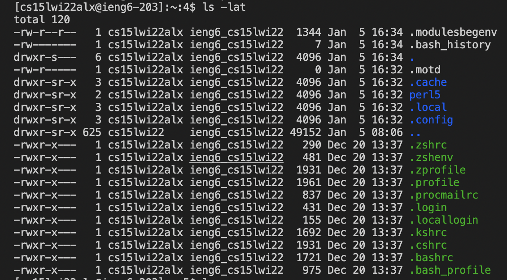
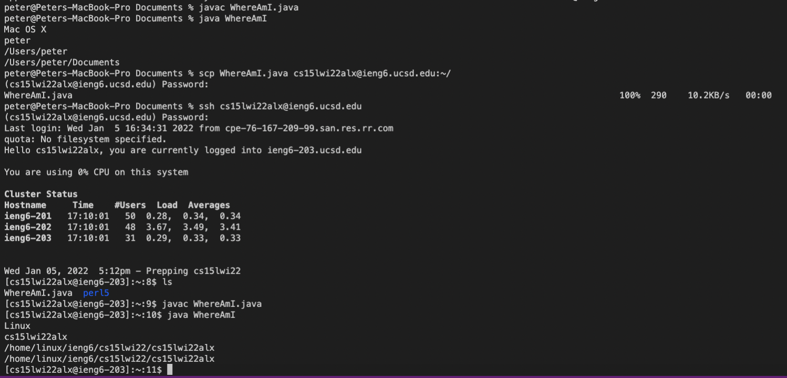
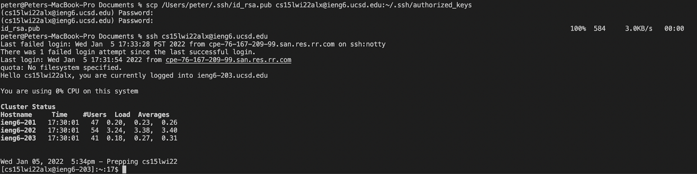
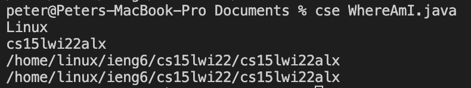

# Lab Report 1

Welcome! This page describes how to log in to, compile, and run programs on your course-specific `ieng6` account.

## Installing VScode

* Download and install [Visual Studio Code](https://code.visualstudio.com/download)
* Open up Visual Studio (VS) Code, and confirm that it looks similar to this:



## Remotely Connecting

* We can use the `ssh` command to remotely access the `ieng6` server (if using Windows, you must first install [OpenSSH](https://docs.microsoft.com/en-us/windows-server/administration/openssh/openssh_install_firstuse))
* Find your account name using the [Account Lookup](https://sdacs.ucsd.edu/~icc/index.php) page, and the password should be the same as your default UCSD password (although you might have to reset it)
* In the VS Code terminal (access through View -> Terminal), type `ssh <your account name>@ieng6.ucsd.edu`, and then type your password (it won't appear as you type it)



## Trying Some Commands

* Now any commands that you type will run on the `ieng6` server
* You can run any command you want, but I chose to run `ls -lat`, which prints out the files in the current directory plus some additional information like permissions, sorted by date of creation



## Moving Files with `scp`

* On your local computer, create a file called `WhereAmI.java` (I created it in the Documents folder), with the following contents:
```
class WhereAmI {
  public static void main(String[] args) {
    System.out.println(System.getProperty("os.name"));
    System.out.println(System.getProperty("user.name"));
    System.out.println(System.getProperty("user.home"));
    System.out.println(System.getProperty("user.dir"));
  }
}
```
* Run it using `javac WhereAmI.java` and `java WhereAmI`, as shown in the first part of my screenshot
* Use `scp`, which copies files from your local computer to the remote server. My command was `scp WhereAmI.java <your account name>@ieng6.ucsd.edu:~/`, which will copy `WhereAmI.java` to your home directory on the server
* Run `javac` and `java` again on the remote server on the same file, and note the differences (in my case, it printed out different operating systems, account names, etc.)



## Setting an SSH Key

* To log in to the remote server without having to use a password each time, you can run `ssh-keygen` on your local computer to generate a key you can use to log in remotely. For the most conveninience, save it in `/Users/<your user name>/.ssh/id_rsa` with no passphrase, and use [`ssh-add`](https://docs.microsoft.com/en-us/windows-server/administration/openssh/openssh_keymanagement#user-key-generation) if using Windows
* As before, `ssh` onto the server and run `mkdir .ssh` to create a folder to put your `ssh` keys, then log out (using `logout`) and `scp` the key file onto the server: 
`scp /Users/<your user name>/.ssh/id_rsa.pub <your account name>@ieng6.ucsd.edu:~/.ssh/authorized_keys`
* Now try to `ssh` onto the server, and hopefully it won't prompt for your password!



## Optimizing Remote Running

* There are a lot of ways to make the process of running a `.java` file on the server easier, but I chose to make a bash file which allows us to easily run a set of commands
* I created a file called `cse` with the following contents:
```
scp $1 cs15lwi22alx@ieng6.ucsd.edu:~/ >/dev/null
ssh cs15lwi22alx@ieng6.ucsd.edu "javac $1 && java ${1/.java/}"
```
* The file specifies commands to copy a given file (supplied as a command line argument, which is read using `$1`) to the remote server (using `>/dev/null` to hide the output), and then using `ssh` to log on to the server and execute the commands
* To be able to run the command anywhere, create what's called a `symlink` using, in my case, `sudo ln -s cse /usr/local/bin/cse`, and then make the file executable with `chmod +x cse`
* Run any `.java` file on the remote server by just calling `cse <file>.java`! Here's an example:



* Calling `cse <file.java>` multiple times in a row only takes 2 keystrokes each time: pressing the up arrow and enter. This is a lot faster than logging into the server and running it there, which can take upwards of 5 keystrokes