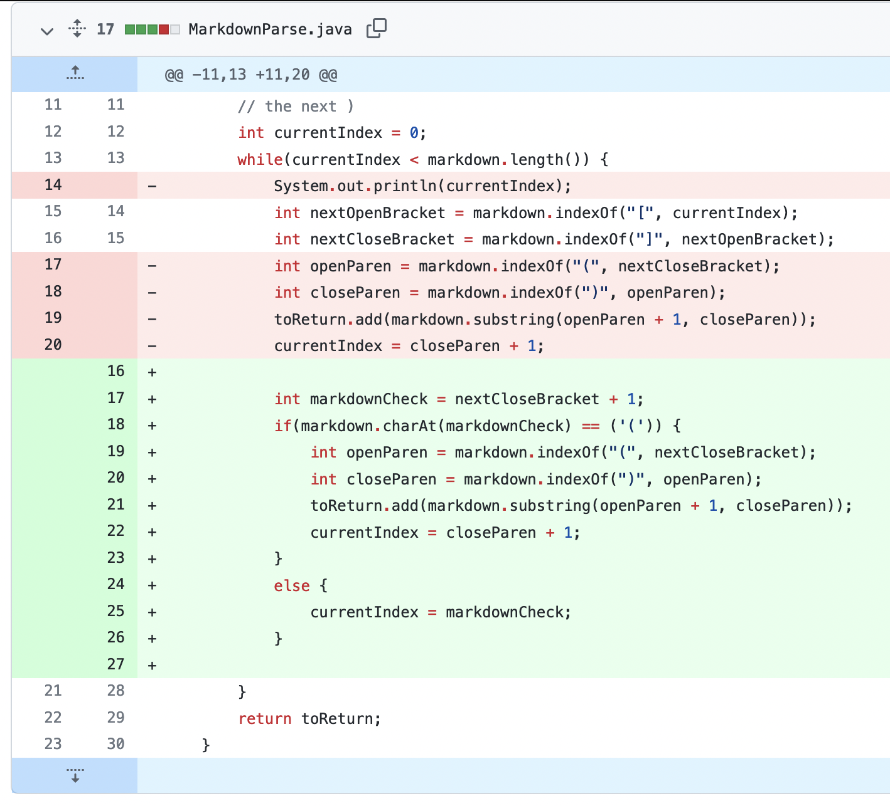
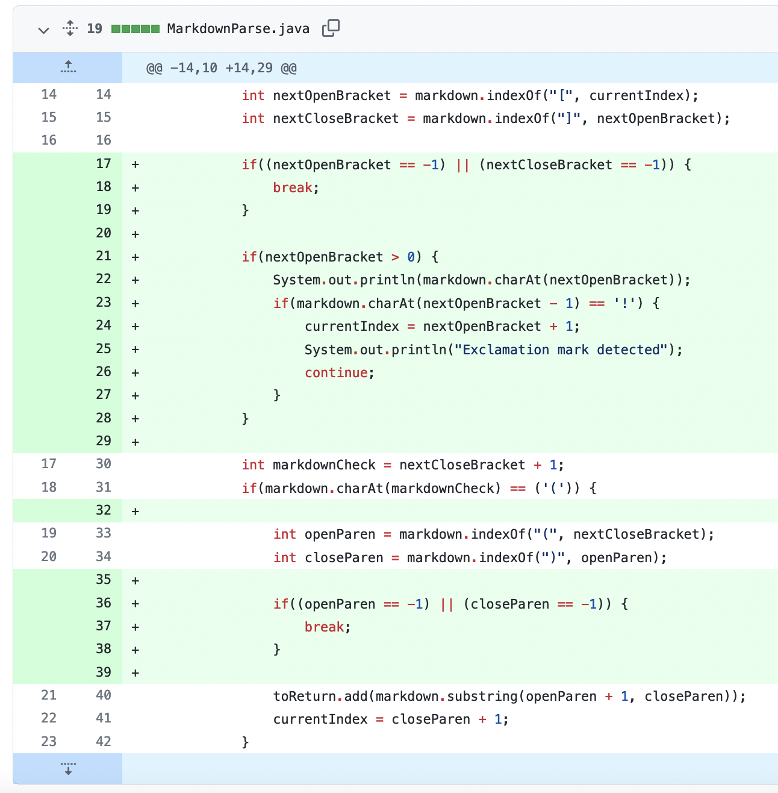
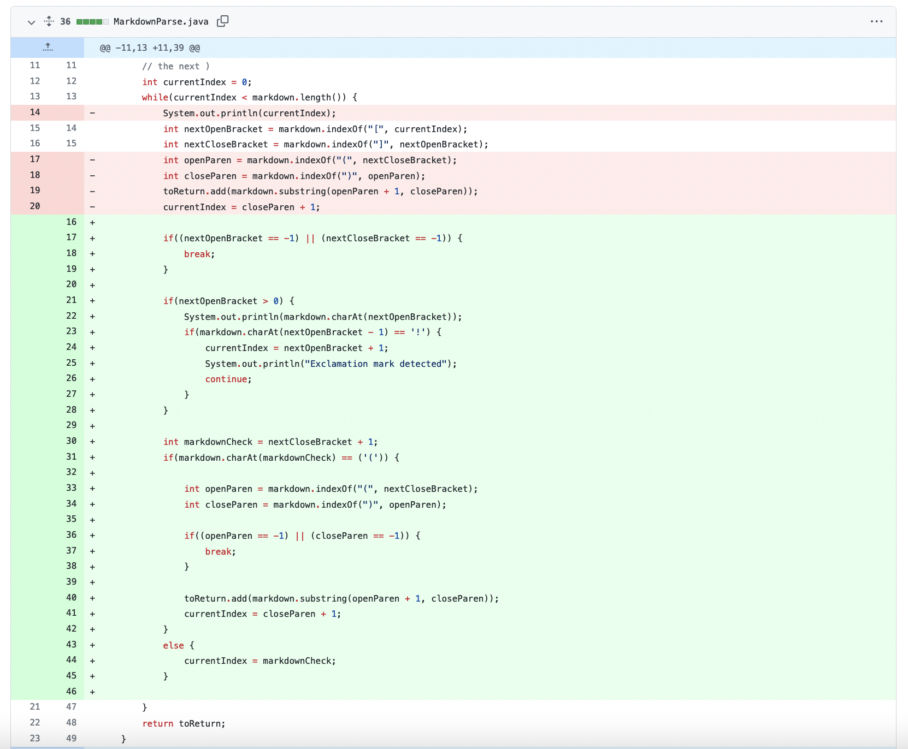

# Lab Report 2

This is a list of changes for fixing the markdown parser file:

1. 
    1. Failing test file: [test-file-two.md](https://github.com/PeterEckmann1/markdown-parse/blob/main/test-file-two.md)
    2. Symptom: `[https://something.com, Miles, Henry, Victor, etc., some-page.html]`
    3. Code change: 
    4. The bug was that we didn't check for space between the `]` and `(` characters, because there should be no space between them. We suspected this could be a potential error, so wrote `test-file-two.md` (failure-inducing input), that caused the above symptom of the program incorrectly printing `Miles, Henry, Victor, etc.` as a link (the symptom), when it should not be.

2. 
    1. Failing test file: [test-file-four.md](https://github.com/PeterEckmann1/markdown-parse/blob/main/test-file-four.md)
    2. Symptom: `[https://something.com, some-page.html, This is a matrix of numbers!]`
    3. Code change: 
    4. The bug was that we weren't checking for an `!` before the start of a potential link, something like `` indicates it's an image, not a link. We figured this might be an issue, so included an example in `test-file-four.md` (failure-inducing input), which incorrectly printed out `This is a matrix of numbers!` (the symptom) when it should not have, because there was an exalamation mark before the `[`.

3. 
    1. Failing test file: [test-file-five.md](https://github.com/PeterEckmann1/markdown-parse/blob/main/test-file-five.md)
    2. Symptom: ```Exception in thread "main" java.lang.StringIndexOutOfBoundsException: String index out of range: 2
        at java.base/java.lang.StringLatin1.charAt(StringLatin1.java:47)
        at java.base/java.lang.String.charAt(String.java:693)
        at MarkdownParse.getLinks(MarkdownParse.java:30)
        at MarkdownParse.main(MarkdownParse.java:52)```
    3. Code change: 
    4. The bug was that we didn't check for `StringIndexOutOfBounds` exceptions when looking for the `(` character after a `]`. We tested this with a test file of only `[]` (failure-inducing input), which caused an exception (the symptom) when looking for the next `(` character, something that should never happen.
