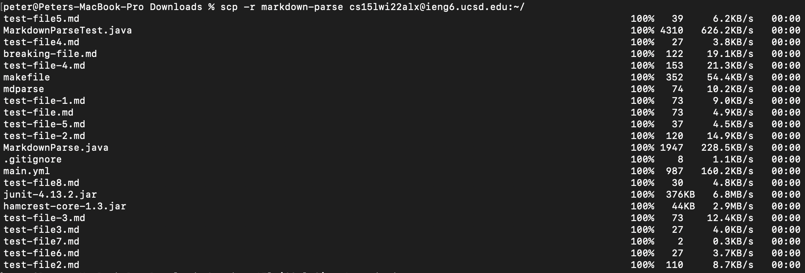
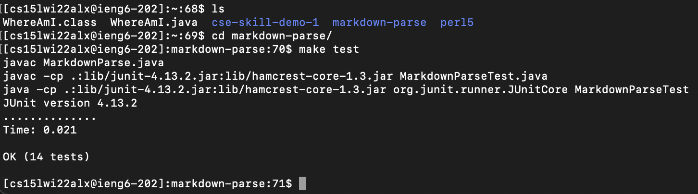

# Lab Report 3

Chosen task: **Copy whole directories with scp -r**

1. **Copying whole directories to a remote server.** The `scp -r` flag (`-r` standing for recursive) lets us copy whole directories from a local computer to a server or vice versa. To copy the `markdown-parse` directory to the remote `ieng6` server, I used `scp -r markdown-parse cs15lwi22alx@ieng6.ucsd.edu:~/`:


2. **Logging in and running tests.** After the folder is moved over, I logged in to the remote server with `ssh cs15lwi22alx@ieng6.ucsd.edu` and ran the tests:


3. **Combining into one command.** To make running remote tests easier, we can combine the transfer of remote files and the running of tests into one command. First I ran `rm -rf markdown-parse/` in the remote directory to remove `markdown-parse`, so that we can make sure our transfer works again. Combining the commands from step 1 and 2 into one, we get: `scp -r markdown-parse cs15lwi22alx@ieng6.ucsd.edu:~/; ssh cs15lwi22alx@ieng6.ucsd.edu "cd markdown-parse/; make test"`. Running these command on my local machine, I get: 

```
peter@Peters-MacBook-Pro Downloads % scp -r markdown-parse cs15lwi22alx@ieng6.ucsd.edu:~/; ssh cs15lwi22alx@ieng6.ucsd.edu "cd markdown-parse; javac MarkdownParse.java"
test-file5.md                                                                                              100%   39     4.8KB/s   00:00    
MarkdownParseTest.java                                                                                     100% 4310   587.1KB/s   00:00    
test-file4.md                                                                                              100%   27     4.1KB/s   00:00    
breaking-file.md                                                                                           100%  122    22.6KB/s   00:00    
test-file-4.md                                                                                             100%  153    26.2KB/s   00:00    
makefile                                                                                                   100%  352    57.1KB/s   00:00    
mdparse                                                                                                    100%   74     9.2KB/s   00:00    
test-file-1.md                                                                                             100%   73    10.3KB/s   00:00    
test-file.md                                                                                               100%   73    11.2KB/s   00:00    
test-file-5.md                                                                                             100%   37     3.3KB/s   00:00    
test-file-2.md                                                                                             100%  120     8.2KB/s   00:00    
MarkdownParse.java                                                                                         100% 1947   269.0KB/s   00:00    
.gitignore                                                                                                 100%    8     1.2KB/s   00:00    
main.yml                                                                                                   100%  987   137.1KB/s   00:00    
test-file8.md                                                                                              100%   30     2.6KB/s   00:00    
junit-4.13.2.jar                                                                                           100%  376KB   7.2MB/s   00:00    
hamcrest-core-1.3.jar                                                                                      100%   44KB   1.7MB/s   00:00    
test-file-3.md                                                                                             100%   73     9.6KB/s   00:00    
test-file3.md                                                                                              100%   27     4.1KB/s   00:00    
test-file7.md                                                                                              100%    2     0.3KB/s   00:00    
test-file6.md                                                                                              100%   27     4.6KB/s   00:00    
test-file2.md                                                                                              100%  110    17.4KB/s   00:00    
JUnit version 4.13.2
..............
Time: 0.021

OK (14 tests)
```