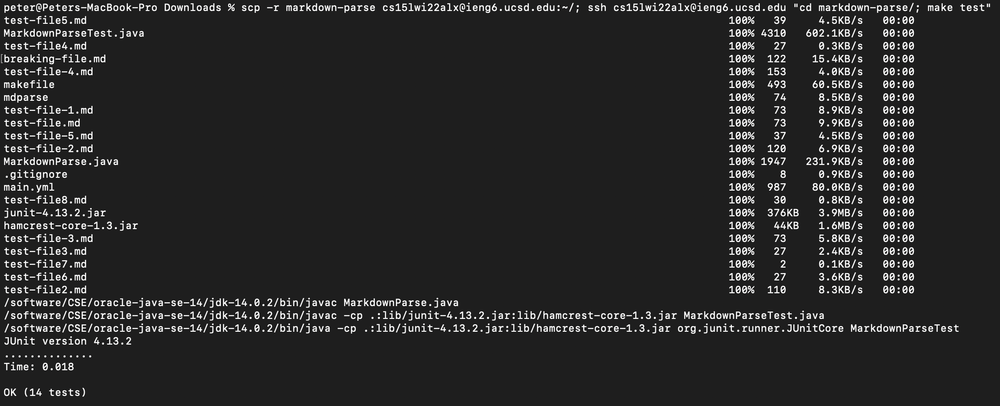

# Lab Report 3

Chosen task: **Copy whole directories with scp -r**

1. **Copying whole directories to a remote server.** The `scp -r` flag (`-r` standing for recursive) lets us copy whole directories from a local computer to a server or vice versa. To copy the `markdown-parse` directory to the remote `ieng6` server, I used `scp -r markdown-parse cs15lwi22alx@ieng6.ucsd.edu:~/`:

2. **Logging in and running tests.** After the folder is moved over, I logged in to the remote server with `ssh cs15lwi22alx@ieng6.ucsd.edu` and ran the tests:

3. **Combining into one command.** To make running remote tests easier, we can combine the transfer of remote files and the running of tests into one command. First I ran `rm -rf markdown-parse/` in the remote directory to remove `markdown-parse`, so that we can make sure our transfer works again. Combining the commands from step 1 and 2 into one, we get: `scp -r markdown-parse cs15lwi22alx@ieng6.ucsd.edu:~/; ssh cs15lwi22alx@ieng6.ucsd.edu "cd markdown-parse/; make test"`. After an error with the one-liner `ssh` using a different version of Java than `ssh`ing and then running commands, I replaced all calls to `javac` and `java` in the makefile to `/software/CSE/oracle-java-se-14/jdk-14.0.2/bin/javac` and `/software/CSE/oracle-java-se-14/jdk-14.0.2/bin/java`, respectively (according to this [Piazza post](https://piazza.com/class/kxs0toocqhv4og?cid=354)). Here is the output with the fixed makefile:
