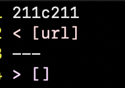
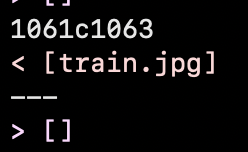

# Lab Report 5

We found different results for test files by running `diff`. We ran a bash for loop:
```
for file in test-files/*.md;
do
  java -cp lib/*:. MarkdownParse $file; echo $file
done
```
And then piped the output to a text file with `> result.txt`. We did this for both implementations of `MarkdownParse`, and then ran `diff` on the resulting two `txt` files to get the cases where results were different.

For `test-files/194.md`, we get the following diff (top is the provided implementation, bottom is ours):



The test file looks like:
```
[Foo*bar\]]:my_(url) 'title (with parens)'

[Foo*bar\]]
```

Which has the expected output `[title (with parents)]` (according to the GitHub parsing). This is expected because the colon `:` denotes a reference, that is called by the second `[Foo*bar\]]`. The link for this reference is then `title (with parents)`, as given in the first line. This is the expected output.

Neither implementations are correct, but the given implementation of `MarkdownParse` is not able to handle this because it does not look for link references (this is the bug). It's not entirely clear where exactly in the code this bug is, because it's a feature that was not even implemented. However, if I were to implement this I would probably add something here (where the arrow is) in `MarkdownParse.java`, which is line 65: 
```
       int nextCloseBracket = markdown.indexOf("]", nextOpenBracket);
 -->   int openParen = markdown.indexOf("(", nextCloseBracket);

    // The close paren we need may not be the next one in the file
    int closeParen = findCloseParen(markdown, openParen);
```
to not just go for the next closing bracket, but to serach the entire file for a reference, i.e. something of the form `[text that was in brackets]:`. This would make the markdown parser at least aware of how references work, but whether that works for all edge cases I'm not sure.

For `test-files/577.md`, we get the following diff (top is the provided implementation, bottom is ours):



The test file looks like:

```

```

The expected output would be `[]`, because `train.jpg` is not a link, it is an image (denoted with a `!` preceding the brackets). Our implementation is correct, and the provided implementation is incorrect. The bug in the provided implementation is that it does not check for a `!` preceding the brackets. The problem happens somewhere around line 57 of `MarkdownParse.java`:
```
int nextOpenBracket = markdown.indexOf("[", currentIndex);
```

It just looks for a `[` and then continues to look for other brackets and paranthesis that make a link. To fix this bug, we need to check for that there is not a `!` that comes before the `[`, so we know we are only checking for links and not images.